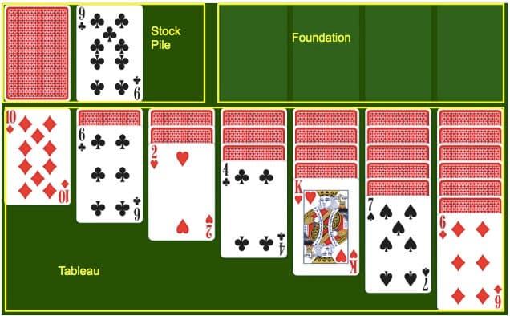

规则，来自：https://solitaired.com/

> Objective: To win solitaire, you need to arrange all the cards into the four empty Foundations piles by suit color and in numerical order, starting from Ace all the way to King.
>
> Tableau:
>
> This is the area where you have seven columns, with the first column containing one card and each sequential column containing one more additional card. The last card of every pile is turned over face up.
>
> Stockpile:
>
> This is where you can draw the remaining cards, which can then be played in the game. If not used, the cards are put into a waste pile. Once all cards are turned over, the remaining cards that have not been moved to either the tableau or foundation can then be redrawn from the stockpile in the same order.
> Solitaire explanation
>
> Playing the game:
> Face up cards in the tableau or stockpile can be moved on top of another face up card in the tableau of an opposite color that is one rank higher, forming a sequence of cards.
>
> Sequencing cards
>
> Groups or stacks of sequenced cards in the tableau can also be moved together on top of a card of the opposite color and higher rank.Stacking
> If a tableau column has only face-down cards remaining, the last card is flipped over and can be played.
>
> Turnover
>
> To start a foundation pile, an Ace must be played. Once a foundation pile is started, only cards of that suit can be placed in that specific pile.
> Aces to foundation
>
> As cards are surfaced from the stockpile or tableau, and there are no other cards on top of them, they may be moved to a foundation pile if they can be placed in the right order.
> Stockpile and tableau to foundation
>
> If a tableau column is empty, you may move a King, and only a King, to that column.
>
> King to empty tableau column
>
> Win by moving all the cards to the Foundation piles in the right order.

UML如下：

